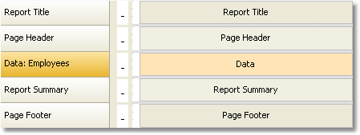
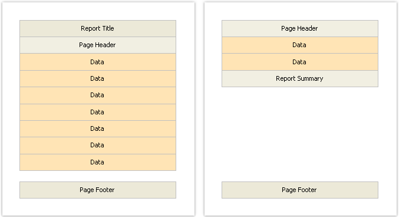

# 2.3. Bands

The band is an object which is located directly on the report page and is a container for other objects like "Text", "Picture" and others.

In all, in FastReport there are 13 types of bands. Depending on its type, the band is printed in a certain place in the report.

| Band | How it's printed |
|:-|:-|
| Report Title | It is printed once at the very beginning of the report. You can choose the order of printing - before the "Page Header" band or after it - with the help of the "TitleBeforeHeader" page property. Changing this property can be done with the help of "Properties" window. By default, property is equal to true, that is, report title is printed before page header. |
| Report Summary | It is printed once at the end of the report, after the last data row, but before the "Page Footer" band. |
| Page Header | It is printed on top of every page of the report. |
| Page Footer | It is printed at the bottom of every page of the report. |
| Column Header | This band is used when printing a multi-columned report (when the number of columns indicated in the page setup > 1). It is printed on top of every column after the Page Header band. |
| Column Footer | Printed at the bottom of every column, before the Page Footer band. |
| Data | This band is connected to the data source and is printed as many times as there are rows in the source. |
| Data Header | This band is connected to the "Data" band and is printed before the first data row. |
| Data Footer | This band is connected to the "Data" band and is printed after the last data row. |
| Group Header | It is printed at the beginning of every group, when the value of the group condition changes. |
| Group Footer | It is printed at the end of every group. |
| Child | This band can be connected to any band, including another child band. It is printed immediately after its parent. |
| Overlay | Printed as a background on every report page. |

So, there are several bands placed on the page. How will FastReport compose a prepared report? Let us look at the following example:

The "Report Title" band will be printed first. The "Page Header" band will be printed immediately after it. Further, the "Data" band will be printed as many times as there are rows in the data source, to which the band is connected. After all the rows of the "Data" band  have been printed, the "Report Summary" band is printed and at the bottom of the page - the "Page Footer" band. Printing of the report ends with this. A prepared report will be looking something like this:

In the process of printing, FastReport checks if there is enough space on the current page of the prepared report, so that the band can be printed. If there isn’t enough space, the following occurs:

- page footer is printed;
- a new page is added;
- page header is printed;
- continues to print the band which did not fit on the previous page.

Every band has several useful properties, which affect the printing process. 

| Property | Description |
|:-|:-|
| `CanGrow`, `CanShrink` | These properties determine whether a band can grow or shrink depending on the size of the objects contained in the band. If both properties are disabled, the band will always have the size specified in the designer. Read more about this in the "Report Creation" chapter. |
| `CanBreak` | If the property is enabled, FastReport tries to print a part of the band’s contents on the available space, that is, "break" the band. Read more about this in the "Report Creation" chapter. |
| `StartNewPage` | Printing a band with such property begins on a new page. This property is usually used when printing groups; that is, every group is printed on a new page. |
| `PrintOnBottom` | A band with this property is printed at the bottom of the page, before the "Page Footer" band .This can be useful when printing certain documents, where the total sum is supposed to be printed at the bottom of the page. |
| `RepeatOnEveryPage` | The bands - "Data Header", "Data Footer", "Group Header" and "Group Footer" - have got this property. This type of band will be printed on each new page, when data printing is being done. Read more about this in the "Report Creation" chapter. |

---

[Bands](Bands.md) | [Top Page](README.md) | [Report Objects](ReportObjects.md)