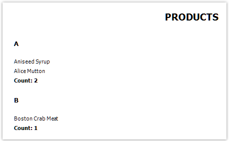

# Creating a report by using code

Let us consider how to create a report in code.

```csharp
Report report = new Report();
// register the "Products" table
report.RegisterData(dataSet1.Tables["Products"], "Products");
// enable it to use in a report
report.GetDataSource("Products").Enabled = true;
// create A4 page with all margins set to 1cm
ReportPage page1 = new ReportPage();
page1.Name = "Page1";
report.Pages.Add(page1);
// create ReportTitle band
page1.ReportTitle = new ReportTitleBand();
page1.ReportTitle.Name = "ReportTitle1";
// set its height to 1.5cm
page1.ReportTitle.Height = Units.Centimeters * 1.5f;
// create group header
GroupHeaderBand group1 = new GroupHeaderBand();
group1.Name = "GroupHeader1";
group1.Height = Units.Centimeters * 1;
// set group condition
group1.Condition = "[Products.ProductName].Substring(0, 1)";
// add group to the page.Bands collection
page1.Bands.Add(group1);
// create group footer
group1.GroupFooter = new GroupFooterBand();
group1.GroupFooter.Name = "GroupFooter1";
group1.GroupFooter.Height = Units.Centimeters * 1;
// create DataBand
DataBand data1 = new DataBand();
data1.Name = "Data1";
data1.Height = Units.Centimeters * 0.5f;
// set data source
data1.DataSource = report.GetDataSource("Products");
// connect databand to a group
group1.Data = data1;
// create "Text" objects
// report title
TextObject text1 = new TextObject();
text1.Name = "Text1";
// set bounds
text1.Bounds = new RectangleF(0, 0, 
Units.Centimeters * 19, Units.Centimeters * 1);
// set text
text1.Text = "PRODUCTS";
// set appearance
text1.HorzAlign = HorzAlign.Center;
text1.Font = new Font("Tahoma", 14, FontStyle.Bold);
// add it to ReportTitle
page1.ReportTitle.Objects.Add(text1);
// group
TextObject text2 = new TextObject();
text2.Name = "Text2";
text2.Bounds = new RectangleF(0, 0, 
Units.Centimeters * 2, Units.Centimeters * 1);
text2.Text = "[[Products.ProductName].Substring(0, 1)]";
text2.Font = new Font("Tahoma", 10, FontStyle.Bold);
// add it to GroupHeader
group1.Objects.Add(text2);
// data band
TextObject text3 = new TextObject();
text3.Name = "Text3";
text3.Bounds = new RectangleF(0, 0, 
Units.Centimeters * 10, Units.Centimeters * 0.5f);
text3.Text = "[Products.ProductName]";
text3.Font = new Font("Tahoma", 8);
// add it to DataBand
data1.Objects.Add(text3);
// group footer
TextObject text4 = new TextObject();
text4.Name = "Text4";
text4.Bounds = new RectangleF(0, 0, 
Units.Centimeters * 10, Units.Centimeters * 0.5f);
text4.Text = "Count: [CountOfProducts]";
text4.Font = new Font("Tahoma", 8, FontStyle.Bold);
// add it to GroupFooter
group1.GroupFooter.Objects.Add(text4);
// add a total
Total groupTotal = new Total();
groupTotal.Name = "CountOfProducts";
groupTotal.TotalType = TotalType.Count;
groupTotal.Evaluator = data1;
groupTotal.PrintOn = group1.Footer;
// add it to report totals
report.Dictionary.Totals.Add(groupTotal);
// run the report
report.Prepare();
...
```
The prepared report looks as follows:



---

[Report Template File Structure](ReportTemplateFileStructure.md) | [Top Page](README.md) | [Using the Report](UsingReport.md)