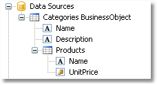

# 3. Data
Any report prints some data. In FastReport, you can operate with the following data:
 
- data sources;
- system variables;
- total values;
- report parameters;
- expressions, containing any of the above mentioned data.

## Data sources

Ordinarily, the data source represents a DB table or SQL query. There can be several data sources in a report. For most of reports, only one data source is needed. A report like Master-Detail needs two data sources which are connected to each other using a relation.
 
Data source has one or several data columns. Each column has a definite data type. Column type is indicated in the "DataType" property.

DB table content is not saved in a report file. Instead, the connection string and the data source schema are stored. A connection string can contain such data as login and password, that is why it is kept ciphered in a report file. When needed, you may increase the safety by using own key for data ciphering. In this case a report file can be opened correctly only in your program. 

## Aliases

Every data element (data sources and columns) has got its own name. By default, this is the name defined in the database. In some cases, it can be difficult to understand what is hidden behind such name, for example, ProdID.

Data elements have got a second name - alias. By using an alias, you can rename an element. For example, if we have got a data source CATEGORY_TABLE with a column called "PROD_ID", you can give the following alias:

```
CATEGORY_TABLE --> Categories
PROD_ID --> Product ID
```

You can refer to such a data column in the following way:

```
[Categories.Product ID]
```

When referring to the data element, you must use the alias, if it has been defined. Never refer to an element by using its original name in this case. 

## Hierarchical data sources

The data sources we have looked at, are relational, that is, they come from a relational DBMS (often called RDBMS). FastReport also supports other kinds of data - the hierarchical data sources. Such data sources come from so-called business objects, which are often used in applications to represent a relational data sources as a .Net classes.

The only way to add a hierarchical data source in your report is to register it programmatically. It will be discussed in the "Programmer's manual". Now we will look at some differences between ordinal and hierarchical data sources. In the figure below you can see two data sources, "Categories BusinessObject" and "Products". As you can see, the "Products" data source is contained within its parent, "Categories BusinessObject":



This means that, these two data sources are related to each other and can be used in the "master-detail" report type. You can also use each of these data sources separately in a "simple list" report type.

---

[Report Objects](ReportObjects.md) | [Top Page](README.md) | [Registering Data](RegisteringData.md)