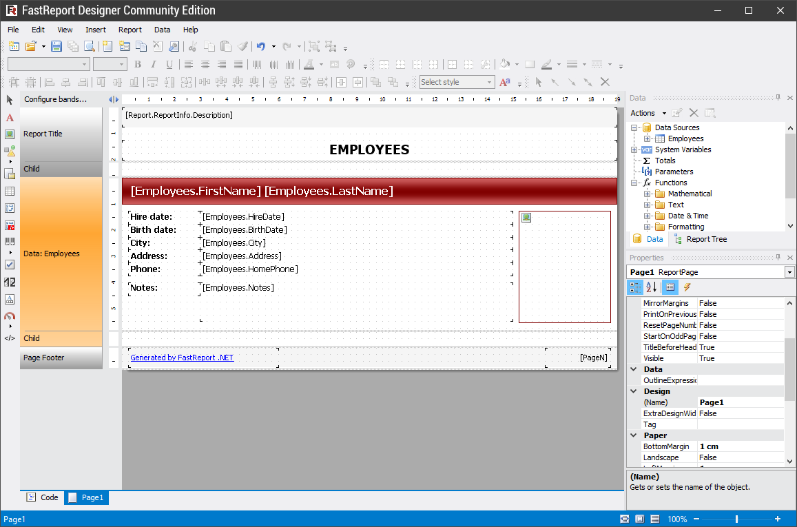

# FastReport Designer Community Edition

The easiest way to create a report template is to use the FastReport Designer Community Edition utility.

The FastReport Designer Community Edition is [Freeware](https://en.wikipedia.org/wiki/Freeware). The file FastReport.Community.zip can be downloaded from [this link](https://github.com/FastReports/FastReport/releases/latest). 

---

[Report Creation](ReportCreation.md) | [Top Page](README.md) | [FastReport Online Designer](FastReportOnlineDesigner.md)