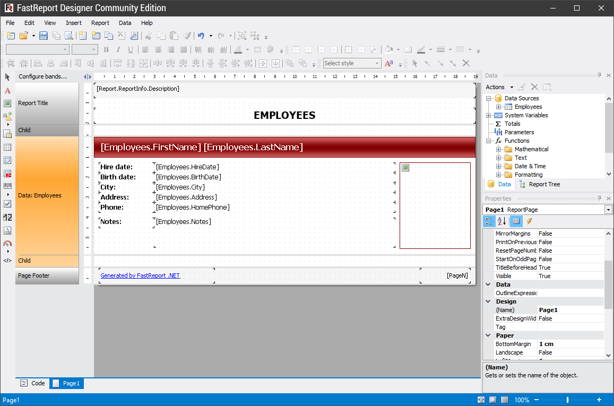

# 2. Fundamentals

In this chapter we will learn the principles of working with a report in the FastReport. 

We will also take a close look at report elements such as report pages, bands, and report objects.

---

[Introduction](Introduction.md) | [Top Page](README.md) | [The Report](Report.md)
