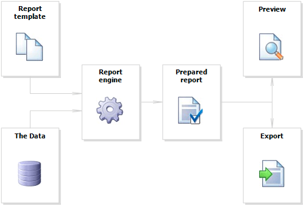

# 2.1. The Report

The report building process can be represented as follows:



Report template (later-Report) - this is, what we see in the Designer. Reports are saved in files with an extension .FRX. A Report can be created with the help of Designer or programmatically.
 
Data can be any: this is data, defined in the program, or data from DBMS, for example, MS SQL. FastReport can also work with  business-logic objects (later - business-objects).

Prepared Report - this is what we see in the preview window (for Desktop application) or in web browser. Prepared report can be previewed, printed, saved in one of the supported formats (.png, jpg, .docx, .xlsx, .pdf  and others).

## Working with Report in a code

To work with Report component in a code, you need to do the following:

- create a report instance; 
- load a report file into it; 
- register the application-defined data in a report; 
- pass the values into the report parameters, if needed; 
- run the report. 

The following example demonstrates how to do this:

```csharp
using (Report report = new Report())
{
  report.Load("report1.frx");
  report.RegisterData(dataSet1, "NorthWind");
  report.Show();
}
```

---

[Fundamentals](Fundamentals.md) | [Top Page](README.md) | [Report Pages](ReportPages.md)