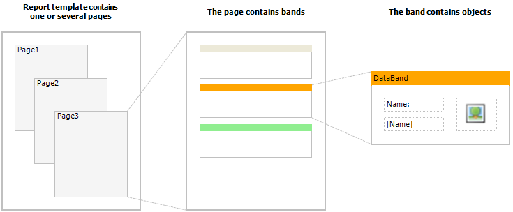
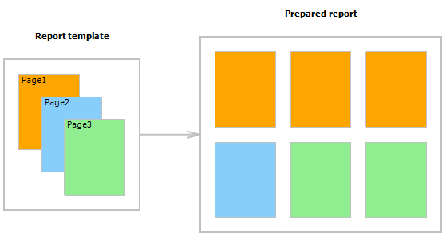

# 2.2. Report Pages

Template consists of one (mostly) or several report pages. Report page, in turn, contains bands. Report objects like Text, Picture and others are placed on the band:

Report template can consist of several pages. For example, you can create a template containing title-page and a page with data. When creating such a report, the first page will be printed first, then the second page and so on. Every page of template can generate one or  several pages of a prepared report – this depends on the data it contains:

Report pages are also used when working with subreports. Contrary to other report generators, subreports in FastReport are saved in a separate template page, and not in a separate file. 

---

[The Report](Report.md) | [Top Page](README.md) | [Band](Bands.md)