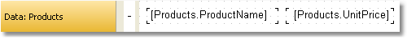
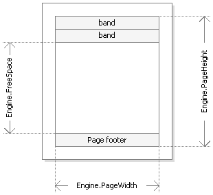

# 5. Script

Script is a higher-level programming language, which is part of the report. Script can be written in one of the following .Net languages:

- C#
- VisualBasic.Net

A script is applicable in many places. Using the script, you can do the following:

- perform data handling, which cannot be done via regular means of the FastReport engine;
- control the printing of report pages and bands on the page;
- control the interaction between elements on dialogue forms;
- control the formation of dynamic "Table" objects;
- and many more.

## Event handlers

A script is mainly used for creating objects' event handlers. For creating event handler select the needed object.

```csharp
private void Text2_BeforePrint(object sender, EventArgs e)
{

}
```

## Report Events

In order to control the report with maximum flexibility, every report object has got several events. For example, in a handler, connected to the `Data` band, you can filter records, that is, hide or show the band depending on certain conditions.

Let us consider the events which are fired during the report generation process. As an example, we will take a simple report, containing one page, one `Data` band and two `Text` objects on the band:



In the beginning of the report, the `Report` object fires the `StartReport` event. Before formation of the report page, the `StartPage` event is fired. This event is fired once for every template page (do not confuse with prepared report page!). In our case, regardless of how many pages were in the prepared report - event is fired once, since the template report has got one page.

Further, printing of the "Data" band row starts. This happens in the following way:
 
1. the `BeforePrint` band event is fired;
2. the `BeforePrint` event of all objects lying on the band is fired;
3. all objects are filled with data;
4. the `AfterData` event of all objects lying on the band is fired;
5. the `BeforeLayout` band event is fired;
6. objects are placed on the band, the height of the band is calculated and band is stretched (if it can);
7. the `AfterLayout` band event is fired;
8. if the band cannot fit on a free space on the page, a new page is formed;
9. the band and all its objects are displayed on a prepared report page;
10. the `AfterPrint` band event is fired;
11. the `AfterPrint` event of all the band objects is fired.

Printing of the band row occurs as long as there is data in the source. After this, the formation of the report in our case ends. The `FinishPage` event of a page is fired and finally - the `FinishReport` event of the `Report` object.

So, by using events of different objects, you can control every step of report formation. The key to correct use of events - full understanding of the band printing process, expound in the eleven steps above. So, a lot of operations can be done, by using only the BeforePrint band - any change, done to the object, will also be displayed. But in this event, it is not possible to analyze, on which page will the band be printed, if it stretches, because the height of the band will be calculated on step 6. This can be done with the help of the AfterLayout event in step 7 or AfterPrint in step 10, but in the latter case, the band is already printed and operations with objects do not give out anything. In one word, you must clearly state, at what moment each event is fired and use, those, which correspond with the given task.

## Reference to report objects

For referring to report objects (for example, `Text` object) use the name of the object. The following example returns the height of `Text1` object:

```csharp
float height = Text1.Height;
```

Note that report's native unit of measurement is screen pixels. Keep it in mind when using such object's properties like `Left`, `Top`, `Width`, and `Height`. To convert pixels into centimeters and back, use the constants, defined in the `Units` class:
 
```csharp
float heightInPixels = Text1.Height;
float heightInCM = heightInPixels / Units.Centimeters;
Text1.Height = Units.Centimeters * 5; // 5см
```

## Report and Engine objects

Apart from objects, which are contained in the report, there are two variables defined in the script: `Report` and `Engine`.

The `Report` variable refers to the current report. In the list below, a list of the report object's methods is given:

| Method | Description |
|:-|:-|
| `object Calc(string expression)` | Calculates an expression and returns the value. When calling this method the first time, an expression gets compiled, which needs some time. |
| `object GetColumnValue(string complexName)` | Returns the value of the data column. The name must be presented in the `DataSource.Column` form. If the column has got the null value, it is converted into a value by default (0, empty string, false). |
| `object GetColumnValueNullable(string complexName)` | Returns the value of the data column. Contrary to the previous method, it does not get converted into a default value and may be null. |
| `Parameter GetParameter(string complexName)` | Returns the reports parameter with the indicated name. Name can be compounded when referring to the nested parameter: "MainParam.NestedParam". |
| `object GetParameterValue(string complexName)` | Returns the value of the report parameter with the indicated name. |
| `void SetParameterValue(string complexName, object value)` | Sets the value of the report parameter with the indicated name. |
| `object GetVariableValue(string complexName)` | Returns the value of the system variable, for example, `Date`. |
| `object GetTotalValue(string name)` | Returns the value of the total, defined in the `Data` window, by its name. |
| `DataSourceBase GetDataSource(string alias)` | Returns the data source, defined in the report, by its name. |

The `Engine` object is an engine that controls the report creation. By using the methods and properties of the engine, you can manage the process of placing bands onto the page. You can use the following properties of the `Engine` object:

| Property | Description |
|:-|:-|
| `float CurX` | Current coordinates on the X-axis. This property can be assigned a value, so as to shift the printed object. |
| `float CurY` | Current printing position on the Y-axis. To this property, a value can be assigned so as to shift the printed object. |
| `int CurColumn` | Number of the current column in a multicolumn report. The first column has the number 0. |
| `int CurPage` | Number of the page being printed. This value can be received from the `Page` system variable. |
| `float PageWidth` | Width of the page minus the size of the left and right margins. |
| `float PageHeight` | Height of the page minus the size of the top and bottom margins. |
| `float PageFooterHeight` | Height of the page footer (and all its child bands). |
| `float ColumnFooterHeight` | Height of the column footer (and all of its child bands). |
| `float FreeSpace` | Size of the free space on the page. |
| `bool FirstPass` | Returns true, if the first (or only) report pass is being executed. Number of passes can be obtained from the `Report.DoublePass` property. |
| `bool FinalPass` | Returns true, if the last (or only) report pass is being executed. |

On the figure below, you can see the meaning of some properties listed above.



`Engine.PageWidth` and `Engine.PageHeight` properties determine the size of the printing area, which is almost always less than the actual size of the page. Size of the printed area is determined by the page margins, which is given by the `LeftMargin`, `TopMargin`, `RightMargin` and `BottomMargin` page properties.

`Engine.FreeSpace` property determines the height of the free space on the page. If there is the "Page footer" band on the page, its height is considered when calculating the FreeSpace. Note that, after printing a band, free space is reduced.

How does the formation of a prepared report page take place? FastReport engine displays bands on the page until there is enough space for band output. When there is no free space, the "Report footer" band is printed and a new empty page is formed. Displaying a band starts from the current position, which is determined by the X and Y coordinates. This position is retuned by the `Engine.CurX` and `Engine.CurY` properties. After printing a band, `CurY` automatically increases by the height of the printed band. After forming a new page, the position of the `CurY` is set to 0. The position of the `CurX` changes when printing a multicolumn report.

`Engine.CurX` and `Engine.CurY` properties are accessible not only for reading, but also for writing. This means that you can shift a band manually by using one of the suitable events. Examples of using these properties can be seen in the "Examples" section.

When working with properties, which return the size or position, remember that, these properties are measured in the screen pixels. 

In the `Engine` object, the following methods are defined:

| Method | Description |
|:-|:-|
| `void AddOutline(string text)` | Adds an element into the report outline and sets the current position to the added element. |
| `void OutlineRoot()` | Sets the current position on the root of the outline. |
| `void OutlineUp()` | Shifts the current position to a higher-level outline element. |
| `void AddBookmark(string name)` | Adds a bookmark. |
| `int GetBookmarkPage(string name)` | Returns the page number on which the bookmark with the indicated name is placed. |
| `void StartNewPage()` | Starts a new page. If the report is multicolumn, a new column is started. |

By using the `AddOutline`, `OutlineRoot`, `OutlineUp` methods, you can form the report outline manually. Usually, this is done automatically with the help of the `OutlineExpression` property, which every band and report page have got.

The `AddOutline` method adds a child element to the current outline element, and makes it current. The current report page and the current position on the page are associated with the new element. If you call the `AddOutline` method several times, then you will have the following structure:

```
Item1
   Item2
       Item3
```

For controlling the current element, there are `OutlineUp` and `OutlineRoot` methods. The first method moves the pointer to the element, located on a higher level. So, the script

```csharp
Engine.AddOutline("Item1");
Engine.AddOutline("Item2");
Engine.AddOutline("Item3");
Engine.OutlineUp();
Engine.AddOutline("Item4");
```

will create the following outline:

```
Item1
   Item2
       Item3
       Item4
```

The `OutlineRoot` method moves the current element to the root of the outline. For example, the following script:

```csharp
Engine.AddOutline("Item1");
Engine.AddOutline("Item2");
Engine.AddOutline("Item3");
Engine.OutlineRoot();
Engine.AddOutline("Item4");
```

will create the following outline:

```
Item1
   Item2
       Item3
Item4
```

For working with bookmarks, the `AddBookmark` and `GetBookmarkPage` methods of the `Engine` object are used. Usually bookmarks are added automatically when using the `Bookmark` property, which all objects of the report have got.

By using the `AddBookmark` method, you can add a bookmark programmatically. This method creates a bookmark on the current page at the current printing position.

The `GetBookmarkPage` method returns the page number on which the bookmark is placed. This method is often used when creating the table of contents, for displaying page numbers. In this case, the report must have a double pass.

## Reference to data sources

Contrary to the FastReport expressions (covered in the "Expressions" section), never use square brackets in script for referring to the data sources. Instead of this, use the `GetColumnValue` method of the `Report` object, which returns the value of the column:

```csharp
string productName = (string)Report.GetColumnValue("Products.Name");
```

As seen, you need to indicate the name of the source and its column. The name of the source can be compound in case, if we are referring to the data source by using a relation. Details about relations can be found in the "Data" chapter. For example, you can refer to a column of the related data source in this way:
 
```csharp
string categoryName = (string)Report.GetColumnValue("Products.Categories.CategoryName");
```

For referring to the data source itself, use the `GetDataSource` method of the `Report` object:
 
```csharp
DataSourceBase ds = Report.GetDataSource("Products");
```

Help on properties and methods of the `DataSourceBase` class can be received from the FastReport.Net Class Reference help system. As a rule, this object is used in the script in the following way:
 
```csharp
// get a reference to the data source
DataSourceBase ds = Report.GetDataSource("Products");
// initialize it
ds.Init();
// enum all rows
while (ds.HasMoreRows)
{
  // get the data column value from the current row
  string productName = (string)Report.GetColumnValue("Products.Name");
  // do something with it...
  // ...
  // go next data row
  ds.Next();
}
```

## Rererence to System Variables

For reference to system variables, use the `GetVariableValue` method of the `Report` object:

```csharp
DateTime date = (DateTime)Report.GetVariableValue("Date");
```

## Reference to Total Values

For reference to the total value, use the `GetTotalValue` method of the `Report` object:
 
```csharp
float sales = Report.GetTotalValue("TotalSales");
```

Total value has got the `FastReport.Variant` type. It can be used directly in any expression, because the `FastReport.Variant` type is automatically converted to any type. For example:
 
```csharp
float tax = Report.GetTotalValue("TotalSales") * 0.2f;
```

Reference to the total value can be done at that time when, it is being processed. Usually the total is "ready to use" at the moment of printing the band, on which it is located in the report.

## Reference to report parameters

For referring to report parameters, use the `GetParameterValue` method of the `Report` object:

```csharp
int myParam = (int)Report.GetParameterValue("MyParameter");
```

Parameters can be nested. In this case, indicate the name of the parent parameter and after the period, the name of the child parameter:

```csharp
Report.GetParameterValue("ParentParameter.ChildParameter")
```

Parameters have got a definite data type. It is given in the `DataType` property of the parameter. You must take this into account when referring to parameters. 

For changing the value of the parameter, use the `SetParameterValue` method of the report object:

```csharp
Report.SetParameterValue("MyParameter", 10);
```

---

[Expressions](Expressions.md) | [Top Page](README.md) | [Report Creation](ReportCreation.md)
