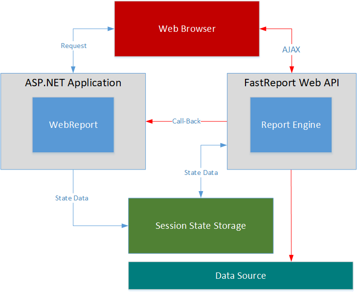

# 9. Reports in Web

## Inside WebReport



## Browsers support

FastReport.OpenSource.Web supports latest versions of Chrome, Firefox, Safari, Opera and Edge browsers.

## Using WebReport in ASP.NET MVC application

1. Add **FastReport.OpenSource.Web** as nuget dependency in your **ASP.NET Core** project:

```xml
<PackageReference Include="FastReport.Web" Version="*" />
```

2. Register **FastReport.OpenSource.Web** in the *Configure* method of your *Startup* class:

```csharp
public void Configure(IApplicationBuilder app, IHostingEnvironment env)
{
    ...
    app.UseFastReport();
    ...
}
```

3. Create WebReport object and render it in your view file:

```csharp
public IActionResult Index()
{
    var webReport = new WebReport();
    webReport.Report.Load("path/to/report.frx");

    return View(webReport);
}
```

```html
@model FastReport.Web.WebReport

<div>
    @await Model.Render()
</div>
```

## Editing a Report in FastReport Online Designer

The WebReport can be used together [FastReport Online Designer](https://www.fast-report.com/en/product/fast-report-online-designer/).

Look at the following example:
```csharp
public IActionResult Index()
{
    var webReport = new WebReport();
    webReport.Report.Load(Server.MapPath("~/App_Data/report.frx"));
    // Enable code editor in the Report Designer
    webReport.Mode = WebReportMode.Design;
    // Disable editing of script code
    webReport.DesignScriptCode = false;
    // Set a path to the Report Designer
    webReport.DesignerPath = "/WebReportDesigner/index.html";
    // Set a path to the Designer Save Callback
    webReport.DesignerSaveCallBack = "~/Home/SaveDesignedReport";
    // Set a ID for using it in Callback
    webReport.ID = "DesignReport";   
    return View(webReport);
}

....

[HttpPost]
// Call-back for save the designed report 
public ActionResult SaveDesignedReport(string reportID, string reportUUID)
{
    ViewBag.Message = String.Format("Confirmed {0} {1}", reportID, reportUUID);
    if (reportID == "DesignReport")
    {
        // Do something with designed report, for example
        Stream reportForSave = Request.InputStream;
        string pathToSave = Server.MapPath("~/App_Data/DesignedReports/test.frx");
        using (FileStream file = new FileStream(pathToSave, FileMode.Create))
        {
            reportForSave.CopyTo(file);
        }
    }
    return View();
}
```
Also you need to create a simple view in `\Views\Home\SaveDesignedReport.cshtml`.

```html
<h2>@ViewBag.Message</h2>
```

Good article about using the Online Designer in ASP .Net Core can be found [here](https://www.fast-report.com/en/blog/196/show/).

## WebReport Examples

You can see some examples [here](https://github.com/FastReports/FastReport/tree/master/Demos/Core).

---

[Exporting](Exporting.md) | [Top Page](README.md)
